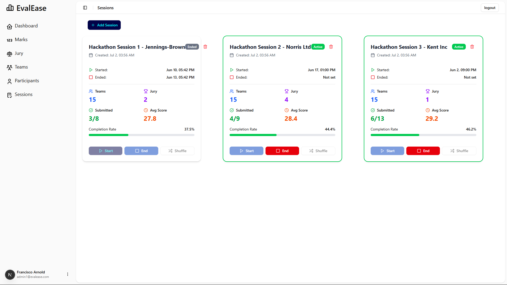
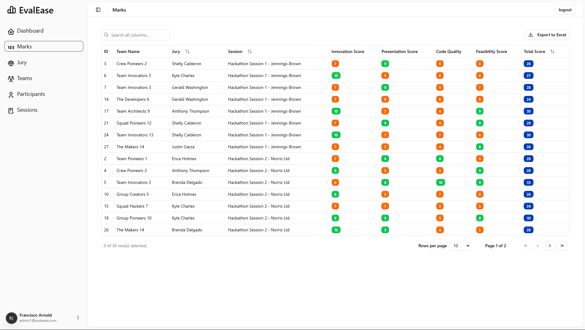
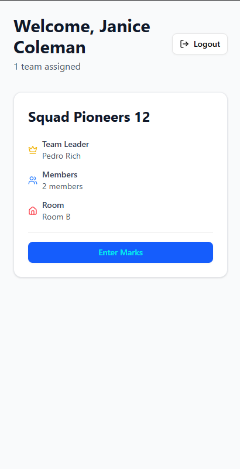

# EvalEase

> **A Modern, Paperless Evaluation Platform for Hackathons and Events**

EvalEase is a full-stack web application designed to digitize and streamline the evaluation process for hackathons and similar events. It eliminates the hassle of paper-based scoring, empowers judges to score teams and manage feedback in real time, and provides organizers with powerful tools for data management and analysis—all in a clean, responsive interface.

---

## 🎯 Why EvalEase?

- **Purpose-Built for Hackathons:** Designed for the fast-paced, high-stakes environment of hackathons, but flexible enough for any event requiring structured evaluation.
- **Paperless & Efficient:** Judges can score teams, leave feedback, and view results instantly—no more lost sheets or manual tabulation.
- **Fair & Transparent:** Smart shuffle functionality ensures randomized, unbiased team assignments for judges, creating a level playing field for all participants.
- **Interactive Data Management:** Organizers can manage participants, sessions, and results using powerful tables and dashboards, with real-time updates and filtering.
- **Secure & Scalable:** Built with Next.js, Drizzle ORM, and Zod, EvalEase ensures robust data validation, secure authentication, and smooth performance for events of any size.

---

## 🚀 Features

- **📄 Paperless Evaluation:** Judges submit scores and feedback directly in the app, ensuring accuracy and efficiency.
- **🔀 Smart Shuffle:** Randomized team assignments for judges to eliminate bias and balance workloads. (See `shuffleTeamsInSession` in `src/db/utils/sessionUtils.ts`)
- **📊 Real-Time Dashboards:** Live updates for scores, rankings, and feedback using TanStack React Table and shadcn UI. (See `DataTable` in `src/components/data-table.tsx`)
- **🔧 Powerful Backend:** Next.js API routes, Drizzle ORM for database management, and Zod for schema validation. (See `src/db/utils/` and `src/zod/`)
- **🔐 Secure Authentication:** JWT-based authentication and custom middleware to protect user data. (See `src/lib/auth.ts` and `src/lib/auth-middleware.ts`)
- **🛡️ Role-Based Access:** Separate interfaces and permissions for organizers, judges, and participants.
- **🌐 Adaptable:** Easily configure for any event format—hackathons, pitch competitions, science fairs, and more.
- **📥 Data Export:** Export results and feedback for post-event analysis. (See `ExportButton` in `src/components/ExportButton.tsx`)

---

## 🖼️ Project Showcase

<!-- Add screenshots or GIFs here -->

*Dashboard: Real-time overview of teams, scores, and rankings.*


*Judge's scoring interface: Simple, intuitive, and mobile-friendly.*



*Smart shuffle: Fair and randomized team assignments for judges.*

---

## 🏗️ Codebase Overview

- **Frontend:**
  - Built with Next.js and React (App Router)
  - UI powered by shadcn UI and TanStack React Table
  - Responsive layouts and modern design
  - Components: `src/components/` (e.g., `data-table.tsx`, `list2.tsx`, `app-sidebar.tsx`)

- **Backend:**
  - Next.js API routes for server logic
  - Drizzle ORM for type-safe database access (`src/db/utils/`)
  - Zod for schema validation (`src/zod/`)
  - JWT-based authentication and session management (`src/lib/auth.ts`)

- **Key Features in Code:**
  - **Team/Jury Shuffle:** `shuffleTeamsInSession` in `src/db/utils/sessionUtils.ts` ensures fair, random team assignments.
  - **Dynamic Tables:** `DataTable` in `src/components/data-table.tsx` for interactive, filterable, and exportable data views.
  - **Role-Based Routing:** Custom middleware in `src/lib/auth-middleware.ts` restricts access based on user roles.
  - **Schema Validation:** All data validated with Zod schemas (see `src/zod/`)
  - **Export:** ExportButton and `exportUtils.ts` for easy data export.

---

>  Password for [vercel](https://evalease.vercel.app/)
  - Username: admin@test.com
  - password: admin@1234
  - Type: Administrator

> On panel you can create mock data to test the features as you like
---

## 🛠️ Setup Process

### 1. Clone the Repository

```sh
git clone https://github.com/your-username/EvalEase.git
cd EvalEase
```

### 2. Install Dependencies

```sh
npm install
```

### 3. Configure Environment Variables

Copy the example environment file and fill in your database and secret values:

```sh
copy .env.example .env
```

Edit `.env` with your credentials:

```
DATABASE_HOST=your_db_host
DATABASE_USER=your_db_user
DATABASE_PASSWORD=your_db_password
DATABASE_NAME=your_db_name
DATABASE_PORT=your_db_port
NEXTAUTH_SECRET=your_nextauth_secret
```

### 4. Run Database Migrations

Make sure your database is running, then run:

```sh
npm run db:migrate
```

### 5. Start the Development Server

```sh
npm run dev
```

Visit [http://localhost:3000](http://localhost:3000) to view the app.

---

## 👀 Main Modules & Screens

- **Dashboard:** Overview of sessions, teams, and scores (`src/app/dashboard/`)
- **Marks:** View and export all marks (`src/app/dashboard/marks/page.tsx`)
- **Jury Management:** Add, edit, and assign jury members (`src/app/dashboard/jury/page.tsx`)
- **Teams & Participants:** Manage teams and participants, import from CSV (`src/app/dashboard/teams/`, `src/app/dashboard/participants/`)
- **Session Management:** Create and manage evaluation sessions (`src/app/dashboard/session/`)
- **Judge's Home:** Personalized team assignments and scoring interface (`src/app/home/page.tsx`, `src/components/list2.tsx`)

---

## 🤝 Contributing

Contributions are welcome! Please open issues or submit pull requests for improvements, bug fixes, or new features.

---

## 📄 License

This project is licensed under the [MIT License](LICENSE).